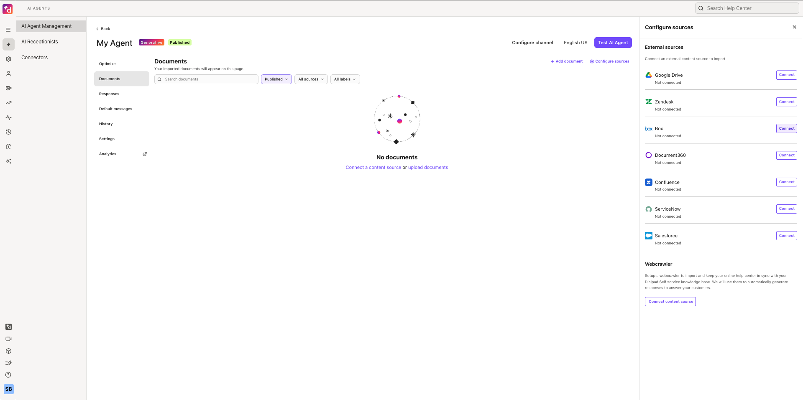
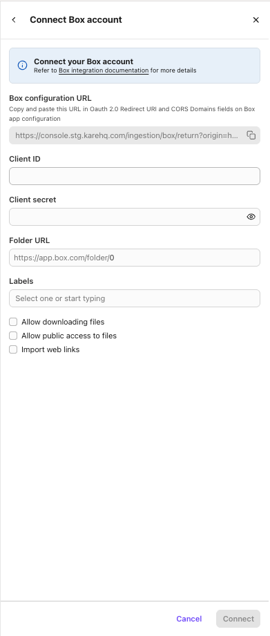
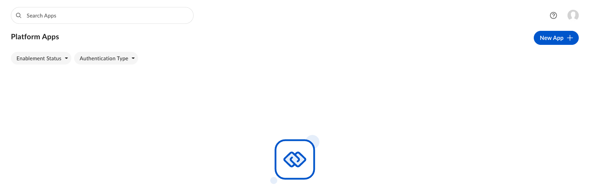
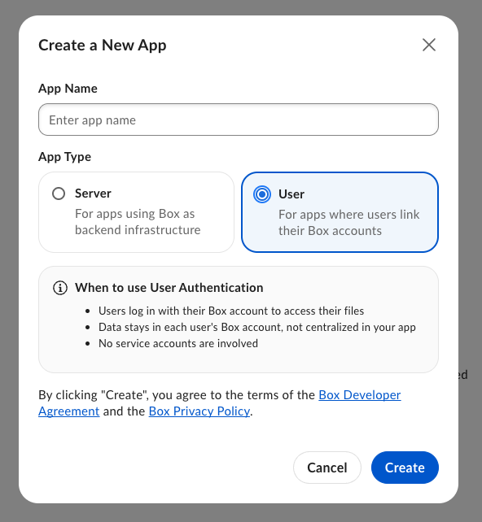
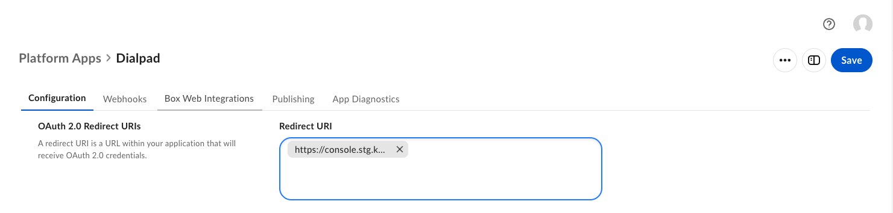
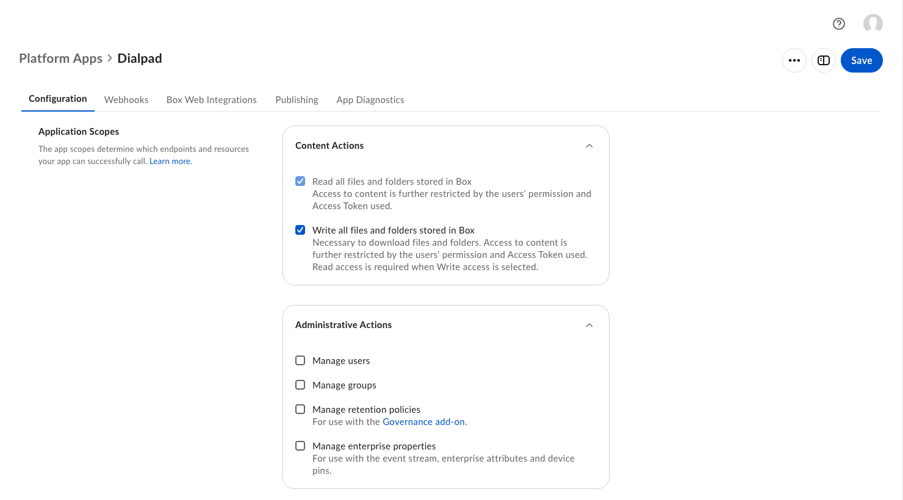
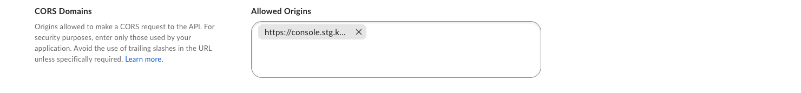

# Connecting a Box account

This step-by-step guide explains how to connect a Box account to your Dialpad knowledgebase.

## Get your Box configuration URL (Step 1/3)

In Dialpad, go to _AI Agents_ > _AI Agent Management_, open the agent you want to configure, go to its _Documents_ tab, then click _Configure sources_ and hit _Connect_ next to _Box_.

This opens the _Connect Box account_ drawer. At the top there's a **Box configuration URL** field with a copy icon — copy it now, you'll need it (and its origin) in the next step.

## Create and configure your Box application (Step 2/3)

Navigate to your [Box developer console](https://app.box.com/developers/console) and click _New App_.

Name your application and, under _App Type_, choose **User** ("For apps where users link their Box accounts"). This is required — Dialpad's integration uses per-user OAuth authorization, not the _Server_ (service-account) app type.

Open the app you just created and go to its _Configuration_ tab. Under **OAuth 2.0 Redirect URIs**, paste the Box configuration URL you copied in Step 1.

Under **Application Scopes**, check both _Read all files and folders stored in Box_ and _Write all files and folders stored in Box_ — Box requires Read to be enabled before it lets you enable Write.

Under **CORS Domains**, paste just the origin of the Box configuration URL — scheme and host only, no path, query string, or trailing slash (e.g. `https://console.us.karehq.com`, not the full `.../ingestion/box/return?origin=...` URL).

Click _Save_. Back on the Configuration tab you'll find your **Client ID** and **Client Secret** — you'll need both in the next step.

## Authorize your Dialpad account (Step 3/3)

Back in the _Connect Box account_ drawer, fill in the rest of the form:

 * **Client ID** and **Client Secret**: the OAuth 2.0 credentials from the Box app's _Configuration_ tab.
 * **Folder URL**: the ID of the Box folder Dialpad should import — paste it after the `https://app.box.com/folder/` prefix shown in the field. It's the number at the end of the folder's URL in your browser, e.g. for `https://app.box.com/folder/123456789` paste `123456789`. Leave it as `0` to import your entire Box account (usually not what you want).
 * **Labels**: pick or type labels to tag every resource imported from Box.
 * **Allow downloading files**: lets users download files, instead of only viewing them online through Box.
 * **Allow public access to files**: by default only Box users in your organization can access imported files; enable this to share them publicly.
 * **Import web links**: also imports web links bookmarked in your Box account.
 * **Custom user agent**: Dialpad identifies itself to websites as `KareBot` when downloading a page; change this if needed.

Click _Connect_. Box will handle the authorization prompt, and once it succeeds your files will start importing into Dialpad.
