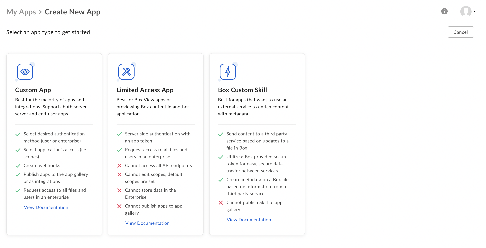
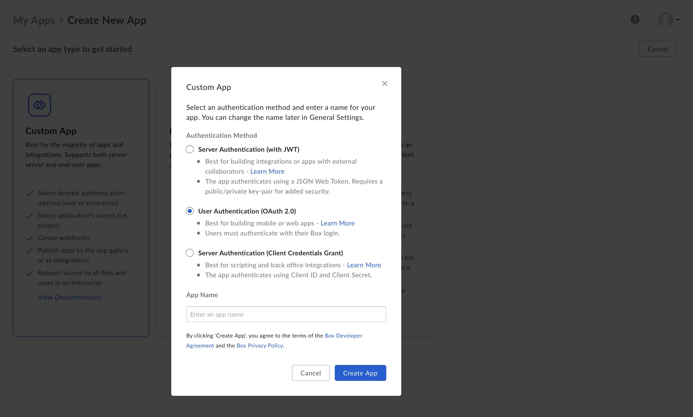
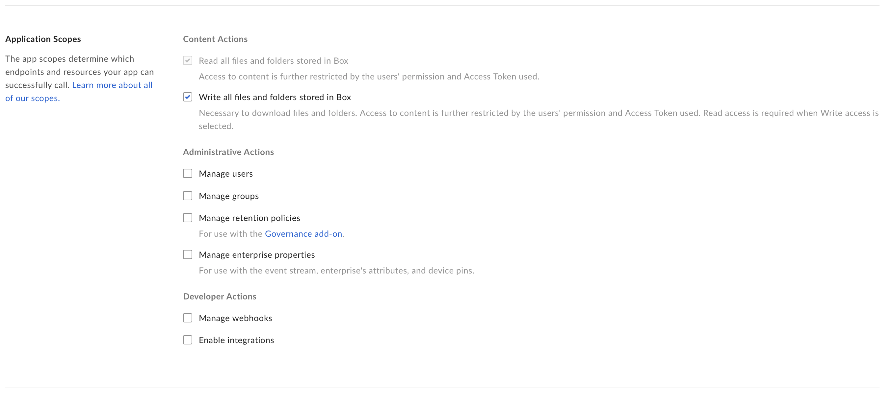
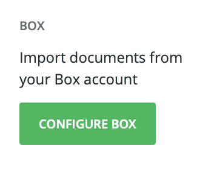
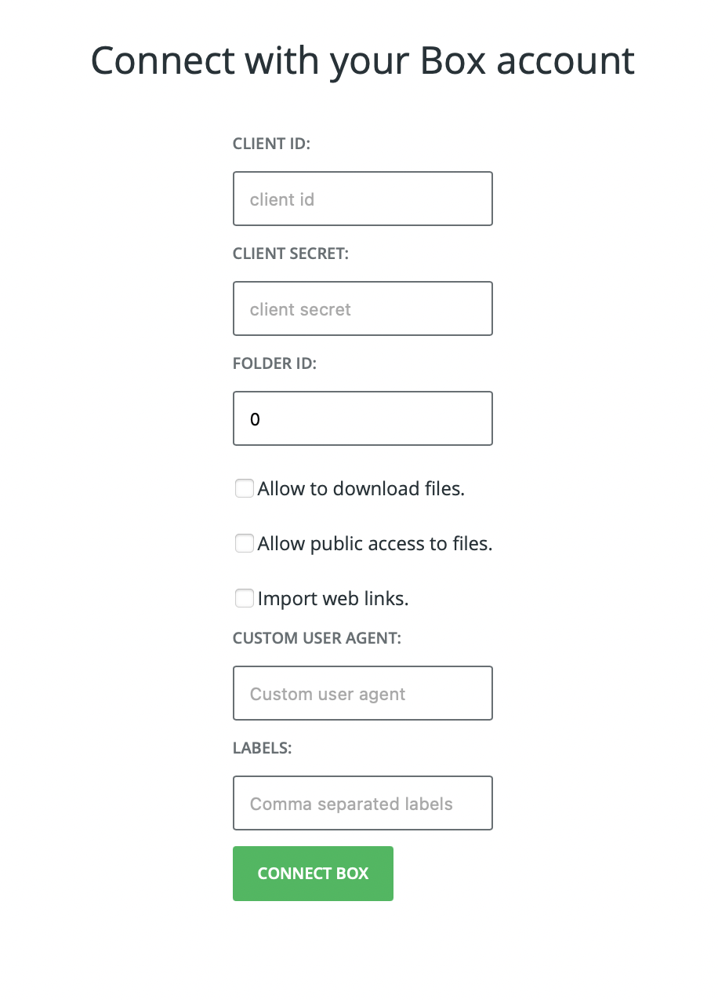

# Connecting a Box account

This step-by-step guide explains how to connect a Box account to your Dialpad knowledgebase.

## Create a new Box application (Step 1/3)

Navigate to your [Box developer console](https://app.box.com/developers/console) and create a new client application by clicking on the _Create New App_ button.

Then choose _Custom App_ from the list of possible applications. Custom applications are the most common and the most powerful.

Finally, select _OAuth 2.0_ as authentication method and name your application in a memorable way, for instance _DIALPAD sync_.

Congratulations, you have just created a Box app!

## Configure your new Box application (Step 2/3)

Open your Box application and navigate to the _Configuration_ tab. If the App was created correctly you should see _OAuth 2.0_ as authentication method.

Now you will need the URL of your DX Console. You can copy that from the browser URL tab once you are signed-in in the DX Console. It should be something like `https://<YOUR-DOMAIN>.karehq.com/details/<ORG-ID>/kbm/box/auth/callback` (CSR) or `https://<YOUR-DOMAIN>.dashboard.karehq.com`. The first word in the URL is your domain. 

In _OAuth 2.0 Redirect URI_ type the following URL by replacing your domain in the template: `https://csr.<ENV>.karehq.com/details/<ORG-ID>/kbm#/box/auth/callback` (or for the legacy Dashboard `https://<YOUR-DOMAIN>.dashboard.karehq.com/box/auth/callback`).

If you make a mistake, don't worry, Box will tell you by highlighting the text field in red.

In _Application Scopes_ selects _Write all files and folders stored in Box_. Dialpad needs that permission to share your files if needed. 

Finally, add `https://csr.<ENV>.karehq.com/details/<ORG-ID>/kbm#/box/auth/callback` (or for the legacy Dashboard `https://<YOUR-DOMAIN>.dashboard.karehq.com/box/auth/callback`) in _CORS Domains_. Please make sure to write your domain name exactly as you did above.

Don't forget to save!

In the middle of the page there should be a box indicating _Client ID_ and _Client Secret_, you will need them in the next step.

## Authorize your Dialpad account (Step 3/3)

Open the DX Console and navigate to _Data Import_ tab of the settings page. Only administrators can access it.
Once you are there click on _Configure Box_.

From this settings page you can now configure Dialpad to import and use content from Box. It is really important that you configure it properly because this will configure what Dialpad will do with your files.

Let's explain the various parameters:
 *  **Client ID** and **Client Secret** are the OAuth 2.0 credentials that Dialpad will use to connect. You can find them in the _Configuration_ page od the Box App that we just created.  A user will need to authorize the connection once you press on the _Connect Box_ button at the bottom of the form.
 * **Folder ID** is the ID of the Box folder that Dialpad will import. It's the long number that appears in the URL bar of your browser when you are navigating a Box folder. If you leave `0` Dialpad will import everything in your Box account, normally this is not what you will want to do.
 * **Allow to download files** configure Dialpad to allow users to download files or to just let them access them online through Box.
 * **Allow public access to files** by default only Box users in your organization will have access to Box files. Click this option if you want Dialpad to share them publicly.
 * **Import web links** configure Dialpad to import all web links which are bookmarked in your Box account.
 * **Custom user agent** when downloading a web page Dialpad introduces itself to the website as `KareBot`. If you need you can change this.
 * **labels** configure Dialpad to label all resources imported from Box with the following labels. They must be comma separated like `tutorial,customer-engagement,lead-gen`.

 Once you press connect Box will handle the authentication process and, if the process is successful, your files will appear in Dialpad.
